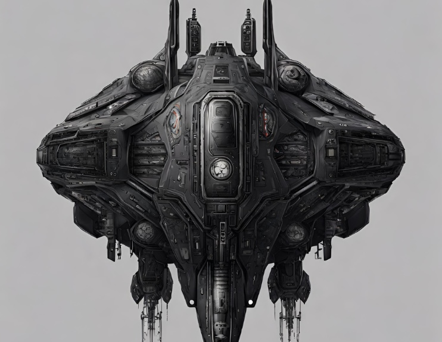

# DataMining
## Data Mining Project Proposal

##### SpaceShip Titanic - Clustering a Disaster
Cufino Fabio IMAPP - Arisi Angelo IMAPP

## Introduction

Welcome to the year 2912, where our data science skills are needed to solve a cosmic
mystery. I've received a transmission from four light-years away, and things aren't
looking good. The Spaceship Titanic was an interstellar passenger liner launched a
month ago. With almost 13,000 passengers on board, the vessel set out on its maiden voyage
transporting emigrants from our solar system to three newly habitable exoplanets orbiting
nearby stars.

While heading towards its first destination, the scorching 55 Cancri E, the unsuspecting
Spaceship Titanic collided with a spacetime anomaly hidden within a dust cloud.
Unfortunately, it met a fate similar to its namesake from 1000 years before. Although the ship
remained intact, almost half of the passengers were transported to an alternate dimension!

With this challenge, we want to clusterize data in order to answers the question: “what sorts of
people were more likely to survive?” using passenger data (ie name, age, gender, socio-
economic class, etc).

## Work

We want to analyze the data with a Python notebook to create clustering models and examine
the received data. We will try to better understand the events that led to this cosmic situation
and contribute to unraveling the mystery behind this space collision.

The goal is to determine which passenger has been `Transported` to another dimension or not.

Real Picture of SpaceShip Titanic

### Data

https://www.kaggle.com/competitions/spaceship-titanic

#### To Do:

1. **Data Exploration and Visualization**
   - Numerical data Distribution
   - Categorical data Distribution

2. **Data Preprocessing**
   - Missing Values Exploration
   - Strategy explanation to deal with missing values
   - Renormalization

3. **Clustering**
   - PCA (Principal Component Analysis)
   - Partition Clustering: K-Means (Average Silhouette Score)
   - Still deciding which one to use (Maybe Spectral Clustering because we will be able to identify non-linear separable clusters)

4. **Validate our model with original labels `Transported`**

5. **Conclusions**

